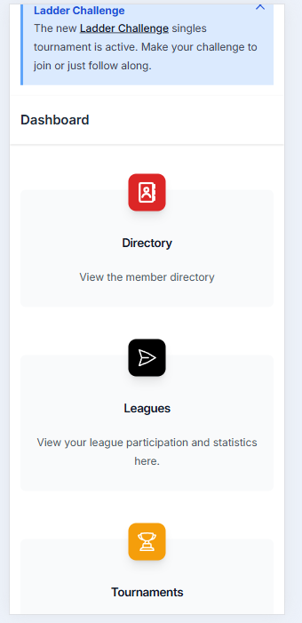
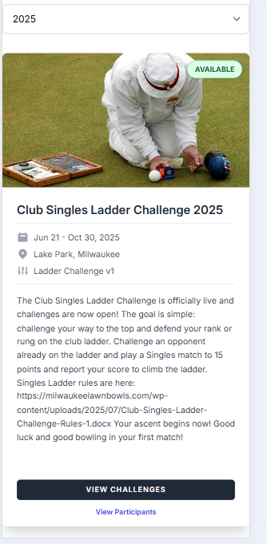
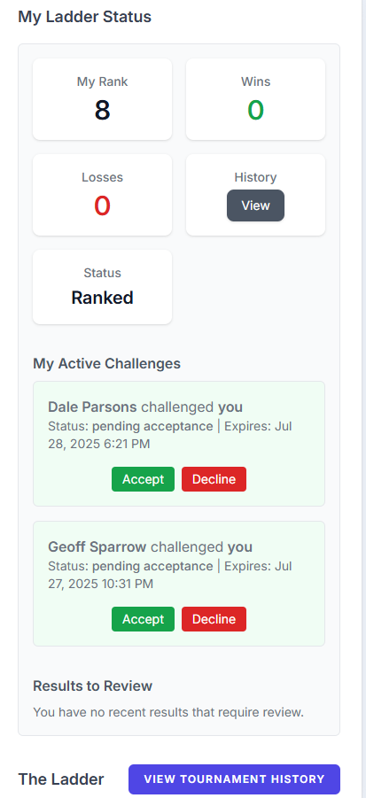
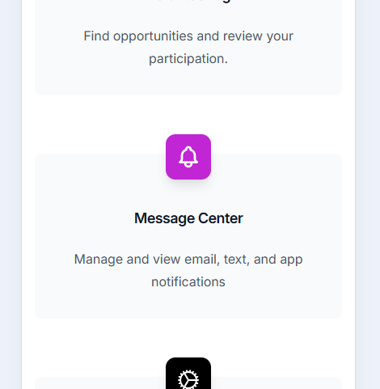
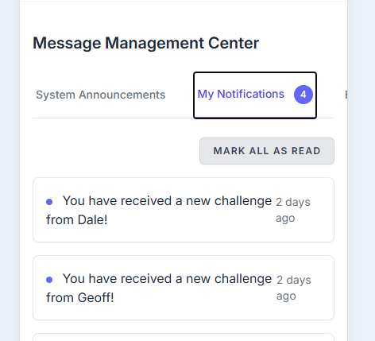

NOTE: Work in progress

## What is the Ladder Challenge?

The goal is simple: challenge your way to the top and defend your rank or rung on the singles ladder. Challenge an opponent already on the ladder and play a Singles match to 15 points and report your score to climb the ladder.

## Viewing the Ladder

There are multiple paths to view the ladder:

1. From the Dashboard:
    - If the global info shows, just click the Ladder Challenge link
    - Otherwise scroll to and click Tournaments.

    

    - Then click View Challenges from the tournament information.

    

    - From here you should see all of your activities. This is your Ladder Dashboard.
    - You have options to Challenge, Cancel, Accept, Enter scores, or Dispute a score. These only show if they are available to you.

    

2. Via Notifications
    - The system will send you notifications to help you track your participation. These are found in the Message Center. To get to and view these notifications:
    - From the Dashboard, scroll to and click Message Center or the notifications icon on the top.

     

    - Select the tab "My Notifications"

     

    - Click a notification to view it in your Ladder Dashboard.

